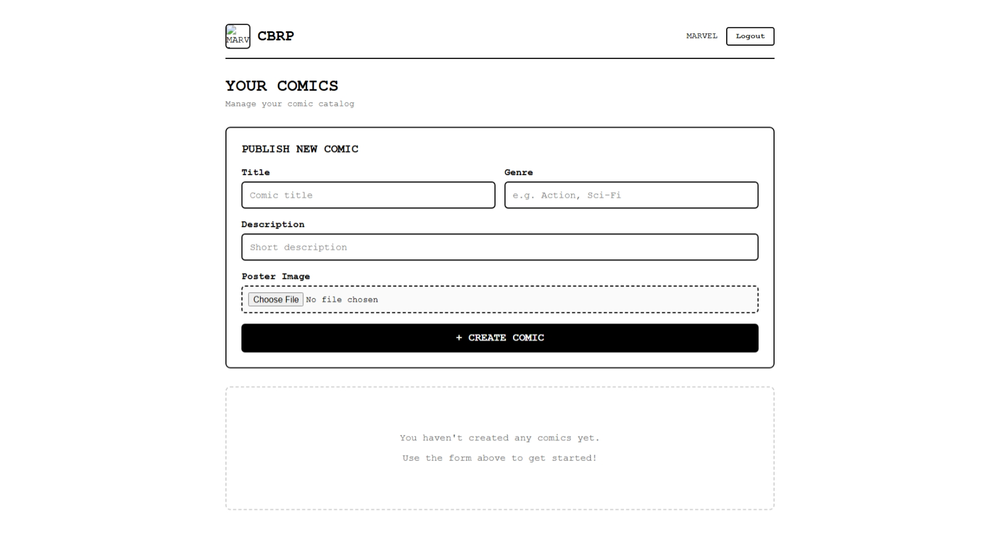
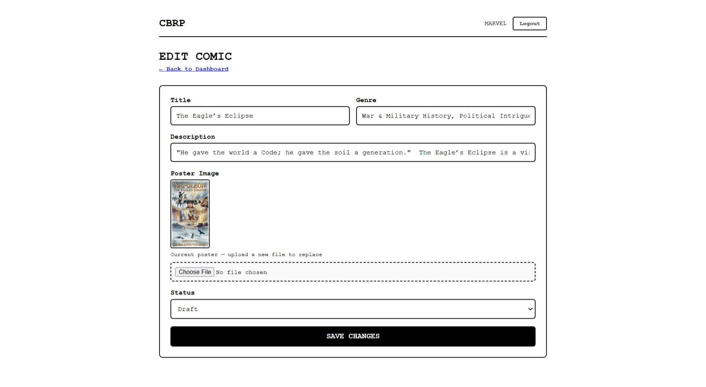
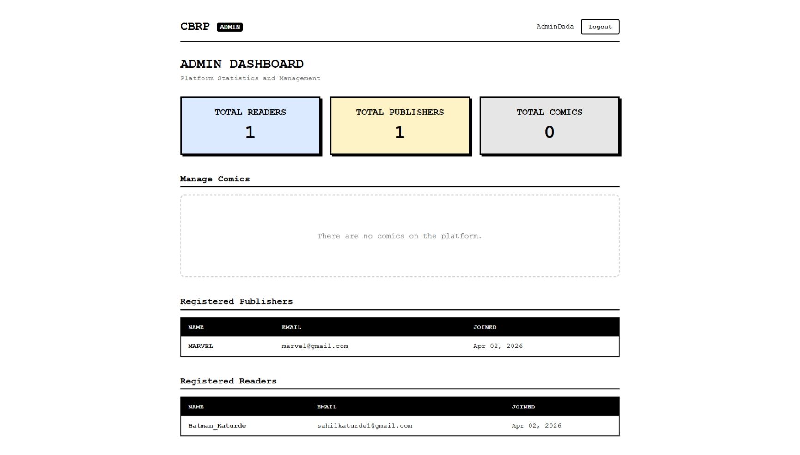

<p align="center">
  
  
  
  
  
</p>

<h1 align="center">📚 Comic Book Reading Platform</h1>

<p align="center">
  <b>A full-stack web application for reading, publishing, and managing comic books online.</b><br/>
  Built with <b>Python Flask</b> and <b>PostgreSQL</b> — featuring role-based dashboards, chapter-by-chapter reading, image uploads, and an admin moderation panel.
</p>

---

## 📋 Table of Contents

- [Features & User Roles](#-features--user-roles)
- [Technologies Used](#️-technologies-used)
- [Application Architecture](#️-application-architecture)
- [Database Schema (A to Z)](#️-database-architecture--schema-explanation-a-to-z)
- [Entity Relationship Diagram](#-entity-relationship-diagram-erd)
- [Project Folder Structure](#-project-folder-structure)
- [File-by-File Explanation](#-file-by-file-explanation)
- [Screenshots](#-screenshots)
- [How to Run Locally](#️-how-to-run-locally)
- [Default Credentials](#-default-credentials)
- [Environment Variables](#-environment-variables)
- [API Endpoints Reference](#-api-endpoints-reference)
- [Application Workflow](#-application-workflow)

---

## 🚀 Features & User Roles

The platform supports **three distinct user roles**, each with a dedicated dashboard and permission set:

| Role | Icon | Capabilities |
|------|------|-------------|
| **Reader** | 👤 | Browse published comics · Read chapters page-by-page · Track reading progress · Bookmark last-read page |
| **Publisher** | ✍️ | Create new comic titles · Upload cover posters · Add/delete chapters · Upload page images · Edit comic metadata · Manage own catalog |
| **Admin** | 🛡️ | View platform-wide comic catalog · Delete any comic for moderation · Oversee all publishers and content |

### ✨ Key Highlights
- 🎨 **Brutalist Minimalist UI** — Clean, bold design with custom CSS
- 📱 **Responsive Design** — Works across desktop and mobile browsers
- 📖 **Chapter-by-Chapter Reader** — Sequential page viewing with progress tracking
- 🔒 **Role-Based Access Control** — Session-based authentication with strict role separation
- 🖼️ **Image Upload Pipeline** — Multi-format support (PNG, JPG, JPEG, WebP, GIF, JFIF) with 16MB max upload
- ⚡ **Quick Publish Workflow** — Publishers can create, upload, and publish comics in minutes
- 🗑️ **Cascade Deletion** — Deleting a comic automatically removes all chapters, pages, and files

---

## 🛠️ Technologies Used

| Layer | Technology | Version | Purpose |
|-------|-----------|---------|---------|
| **Language** | Python | 3.12+ | Core backend language |
| **Web Framework** | Flask | 3.1.3 | HTTP routing, templating, sessions |
| **Database** | PostgreSQL | 16+ | Relational data storage |
| **DB Driver** | psycopg | 3.3.3 (v3) | Modern async-capable PostgreSQL adapter |
| **Templating** | Jinja2 | 3.1.6 | Server-side HTML rendering |
| **Image Processing** | Pillow (PIL) | 12.1.1 | Image validation and processing |
| **Env Management** | python-dotenv | 1.2.2 | `.env` file loading |
| **WSGI Server** | Werkzeug | 3.1.7 | Development HTTP server |
| **Package Manager** | uv / pip | Latest | Dependency resolution |

---

## 🏗️ Application Architecture

The application follows a **layered MVC-style architecture** with clear separation of concerns:

```
┌─────────────────────────────────────────────────────────┐
│                    CLIENT (Browser)                     │
│              HTML Pages + CSS + JavaScript               │
└────────────────────────┬────────────────────────────────┘
                         │ HTTP Requests
                         ▼
┌─────────────────────────────────────────────────────────┐
│                  ROUTES (Controllers)                    │
│   auth_routes.py │ comic_routes.py │ admin_routes.py    │
│         Flask Blueprints handle URL routing              │
└────────────────────────┬────────────────────────────────┘
                         │ Function Calls
                         ▼
┌─────────────────────────────────────────────────────────┐
│                  SERVICES (Business Logic)               │
│                   auth_service.py                        │
│          Validation, role checks, orchestration          │
└────────────────────────┬────────────────────────────────┘
                         │ Function Calls
                         ▼
┌──────────────────────────────────────────────────────────┐
│                  QUERIES (Data Access Layer)              │
│  auth_queries.py │ comic_queries.py │ chapter_queries.py │
│  admin_queries.py                                        │
│         Raw SQL execution via psycopg3                   │
└────────────────────────┬─────────────────────────────────┘
                         │ SQL over TCP
                         ▼
┌─────────────────────────────────────────────────────────┐
│                    PostgreSQL Database                   │
│        7 Tables · ENUM Types · Indexes · FKs            │
└─────────────────────────────────────────────────────────┘
```

### How It Works (Request Lifecycle)
1. **User opens browser** → Flask serves an HTML template (Jinja2 rendered).
2. **User submits form** → Route handler receives POST data.
3. **Route calls Service** → Business logic validates input and enforces rules.
4. **Service calls Query** → Raw SQL is executed against PostgreSQL via `psycopg`.
5. **Query returns data** → Data flows back up through the layers to the template.
6. **Template renders** → Final HTML is sent back to the browser.

---

## 🗄️ Database Architecture & Schema Explanation (A to Z)

The application uses a **PostgreSQL** relational database with **7 tables**, **1 custom ENUM type**, **6 foreign keys**, **3 composite unique constraints**, and **6 performance indexes**.

### Custom ENUM Type

```sql
CREATE TYPE comic_status AS ENUM ('draft', 'published');
```
Used by the `comic` table to restrict publication state to exactly two values.

---

### Table 1: `admin` — System Administrators

| Column | Type | Constraints | Description |
|--------|------|-------------|-------------|
| `id` | BIGINT | PRIMARY KEY, Auto-generated | Unique identifier |
| `name` | VARCHAR(100) | NOT NULL | Administrator's full name |
| `email` | VARCHAR(150) | NOT NULL, UNIQUE | Login email (no duplicates allowed) |
| `password` | TEXT | NOT NULL | Access credential |
| `created_at` | TIMESTAMPTZ | DEFAULT CURRENT_TIMESTAMP | Account creation timestamp |

**Purpose:** Stores superuser accounts who can moderate the entire platform.

---

### Table 2: `publisher` — Content Creators

| Column | Type | Constraints | Description |
|--------|------|-------------|-------------|
| `id` | BIGINT | PRIMARY KEY, Auto-generated | Unique identifier |
| `name` | VARCHAR(100) | NOT NULL | Publisher/studio display name |
| `email` | VARCHAR(150) | NOT NULL, UNIQUE | Login email |
| `password` | TEXT | NOT NULL | Access credential |
| `logo_url` | TEXT | NULLABLE | Path to uploaded avatar/logo image |
| `created_at` | TIMESTAMPTZ | DEFAULT CURRENT_TIMESTAMP | Account creation timestamp |

**Purpose:** Users authorized to create and manage comic book content.
**Relationships:** `publisher` → **One-to-Many** → `comic`

---

### Table 3: `reader` — End Users / Consumers

| Column | Type | Constraints | Description |
|--------|------|-------------|-------------|
| `id` | BIGINT | PRIMARY KEY, Auto-generated | Unique identifier |
| `name` | VARCHAR(100) | NOT NULL | Display name |
| `email` | VARCHAR(150) | NOT NULL, UNIQUE | Login email |
| `password` | TEXT | NOT NULL | Access credential |
| `created_at` | TIMESTAMPTZ | DEFAULT CURRENT_TIMESTAMP | Account creation timestamp |

**Purpose:** Regular users who browse and read comics.
**Relationships:** `reader` → **One-to-Many** → `reading_progress`

---

### Table 4: `comic` — Core Publication Entity

| Column | Type | Constraints | Description |
|--------|------|-------------|-------------|
| `id` | BIGINT | PRIMARY KEY, Auto-generated | Unique identifier |
| `publisher_id` | BIGINT | NOT NULL, FOREIGN KEY → `publisher(id)` | Owner reference |
| `title` | TEXT | NOT NULL | Comic book title |
| `description` | TEXT | NULLABLE | Synopsis / summary |
| `genre` | VARCHAR(80) | NULLABLE | Category tag (e.g., Action, Fantasy) |
| `poster_url` | TEXT | NULLABLE | Path to cover image |
| `status` | `comic_status` | DEFAULT `'draft'` | Publication state (`draft` or `published`) |
| `created_at` | TIMESTAMPTZ | DEFAULT CURRENT_TIMESTAMP | Creation timestamp |

**Purpose:** Central catalog entity representing a comic book series.
**CASCADE Rule:** Deleting a publisher automatically deletes all their comics.
**Indexes:** `idx_comic_publisher` (fast publisher lookups), `idx_comic_status` (fast filtering by draft/published)
**Relationships:** `comic` → **One-to-Many** → `chapter`

---

### Table 5: `chapter` — Episodes / Issues

| Column | Type | Constraints | Description |
|--------|------|-------------|-------------|
| `id` | BIGINT | PRIMARY KEY, Auto-generated | Unique identifier |
| `comic_id` | BIGINT | NOT NULL, FOREIGN KEY → `comic(id)` | Parent comic reference |
| `chapter_number` | INT | NOT NULL | Sequential order number |
| `title` | TEXT | NULLABLE | Optional chapter name |
| `published_at` | TIMESTAMPTZ | DEFAULT CURRENT_TIMESTAMP | Release timestamp |

**Purpose:** Episodic content units within a comic.
**CASCADE Rule:** Deleting a comic automatically deletes all its chapters.
**UNIQUE Constraint:** `(comic_id, chapter_number)` — Prevents duplicate chapter numbers (e.g., two "Chapter 3"s in the same comic).
**Index:** `idx_chapter_comic` for fast chapter listing.
**Relationships:** `chapter` → **One-to-Many** → `page` | `chapter` → **One-to-Many** → `reading_progress`

---

### Table 6: `page` — Image Assets / Panels

| Column | Type | Constraints | Description |
|--------|------|-------------|-------------|
| `id` | BIGINT | PRIMARY KEY, Auto-generated | Unique identifier |
| `chapter_id` | BIGINT | NOT NULL, FOREIGN KEY → `chapter(id)` | Parent chapter reference |
| `page_number` | INT | NOT NULL | Visual reading order |
| `image_url` | TEXT | NOT NULL | File path to the image |

**Purpose:** Stores the exact sequence of images that a reader views.
**CASCADE Rule:** Deleting a chapter purges all its pages and image references.
**UNIQUE Constraint:** `(chapter_id, page_number)` — Ensures no duplicate page numbers within a chapter.
**Index:** `idx_page_chapter` for lightning-fast sequential fetching.

---

### Table 7: `reading_progress` — Bookmark / State Engine

| Column | Type | Constraints | Description |
|--------|------|-------------|-------------|
| `id` | BIGINT | PRIMARY KEY, Auto-generated | Unique identifier |
| `reader_id` | BIGINT | NOT NULL, FOREIGN KEY → `reader(id)` | Which reader |
| `chapter_id` | BIGINT | NOT NULL, FOREIGN KEY → `chapter(id)` | Which chapter |
| `last_page` | INT | NOT NULL, DEFAULT `1` | Last viewed page number |
| `completed` | BOOLEAN | DEFAULT `FALSE` | Flipped to TRUE on chapter completion |
| `updated_at` | TIMESTAMPTZ | DEFAULT CURRENT_TIMESTAMP | Last activity timestamp |

**Purpose:** Junction table that tracks exactly where each reader stopped in each chapter.
**CASCADE Rule:** Removing a reader or chapter auto-cleans all progress records.
**UNIQUE Constraint:** `(reader_id, chapter_id)` — Exactly ONE progress record per reader-chapter pair.
**Index:** `idx_progress_reader` for quickly loading a reader's full history.

---

## 🔗 Entity Relationship Diagram (ERD)

```
┌──────────────┐
│    admin     │          (Independent — no FK relationships)
│──────────────│
│ id (PK)      │
│ name         │
│ email (UQ)   │
│ password     │
│ created_at   │
└──────────────┘


┌──────────────┐       1 : N       ┌──────────────┐       1 : N       ┌──────────────┐
│  publisher   │ ──────────────▶  │    comic     │ ──────────────▶  │   chapter    │
│──────────────│                   │──────────────│                   │──────────────│
│ id (PK)      │                   │ id (PK)      │                   │ id (PK)      │
│ name         │                   │ publisher_id │◀── FK            │ comic_id     │◀── FK
│ email (UQ)   │                   │ title        │                   │ chapter_number│
│ password     │                   │ description  │                   │ title        │
│ logo_url     │                   │ genre        │                   │ published_at │
│ created_at   │                   │ poster_url   │                   └──────┬───────┘
└──────────────┘                   │ status (ENUM)│                          │
                                   │ created_at   │                    1 : N │
                                   └──────────────┘                          ▼
                                                                   ┌──────────────┐
                                                                   │    page      │
┌──────────────┐                                                   │──────────────│
│   reader     │                                                   │ id (PK)      │
│──────────────│                                                   │ chapter_id   │◀── FK
│ id (PK)      │       1 : N       ┌──────────────────┐            │ page_number  │
│ name         │ ──────────────▶  │ reading_progress  │            │ image_url    │
│ email (UQ)   │                   │──────────────────│            └──────────────┘
│ password     │                   │ id (PK)          │
│ created_at   │                   │ reader_id (FK)   │◀── FK to reader
└──────────────┘                   │ chapter_id (FK)  │◀── FK to chapter
                                   │ last_page        │
                                   │ completed         │
                                   │ updated_at        │
                                   └──────────────────┘
```

### Relationship Summary Table

| Relationship | Type | FK Column | CASCADE Behavior |
|-------------|------|-----------|-----------------|
| `publisher` → `comic` | One-to-Many | `comic.publisher_id` | Delete publisher → deletes all their comics |
| `comic` → `chapter` | One-to-Many | `chapter.comic_id` | Delete comic → deletes all chapters |
| `chapter` → `page` | One-to-Many | `page.chapter_id` | Delete chapter → deletes all pages |
| `reader` → `reading_progress` | One-to-Many | `reading_progress.reader_id` | Delete reader → deletes all progress |
| `chapter` → `reading_progress` | One-to-Many | `reading_progress.chapter_id` | Delete chapter → deletes all progress |

### Full Cascade Chain
```
Delete Publisher → Comics → Chapters → Pages (files + DB rows)
                                    → Reading Progress records
```

---

## 📁 Project Folder Structure

```text
Comic_Book_Reading_Platform/
│
├── 📂 app/                          # Main application package
│   ├── __init__.py                  # Application factory (create_app)
│   ├── db.py                        # Database connection setup (psycopg)
│   ├── .env                         # Environment variables (DB credentials)
│   │
│   ├── 📂 routes/                   # Flask Blueprint controllers
│   │   ├── auth_routes.py           # Login, Register, Logout, Home redirect
│   │   ├── comic_routes.py          # Reader views, Publisher CRUD, Chapter/Page management
│   │   └── admin_routes.py          # Admin dashboard and moderation
│   │
│   ├── 📂 services/                 # Business logic layer
│   │   └── auth_service.py          # User registration & login validation
│   │
│   ├── 📂 queries/                  # SQL data access layer
│   │   ├── auth_queries.py          # INSERT/SELECT for admin, publisher, reader tables
│   │   ├── comic_queries.py         # CRUD operations for comic table
│   │   ├── chapter_queries.py       # CRUD operations for chapter & page tables
│   │   └── admin_queries.py         # Admin-specific data queries
│   │
│   ├── 📂 utils/                    # Helper functions
│   │   ├── __init__.py              # Package init
│   │   └── upload_utils.py          # File saving, validation, poster/logo/page handlers
│   │
│   ├── 📂 templates/                # Jinja2 HTML templates (10 pages)
│   │   ├── login.html               # Login form (role selector + email/password)
│   │   ├── register.html            # Registration form (with logo upload for publishers)
│   │   ├── info.html                # Project information / about page
│   │   ├── reader_home.html         # Reader library — comic grid with thumbnails
│   │   ├── reader_comic.html        # Comic detail view — chapters list
│   │   ├── reader_no_content.html   # Empty state when no comics are published
│   │   ├── publisher_home.html      # Publisher dashboard — own comic catalog
│   │   ├── publisher_edit.html      # Edit comic metadata form
│   │   ├── publisher_chapters.html  # Chapter management — add/upload/delete chapters
│   │   └── admin_home.html          # Admin moderation panel — all comics overview
│   │
│   ├── 📂 static/                   # Static assets
│   │   ├── style.css                # Global stylesheet (12KB, Brutalist Minimalist design)
│   │   └── 📂 background/          # Background images used in UI
│   │
│   └── 📂 screenshot/              # Documentation screenshots
│       ├── publisher_page.png       # Publisher dashboard screenshot
│       ├── edit_page.png            # Edit comic page screenshot
│       └── admin_page.png           # Admin dashboard screenshot
│
├── 📂 Data/                         # Runtime file storage (gitignored in production)
│   └── 📂 comics/                   # Uploaded comic content
│       └── 📂 {comic_id}/          # Per-comic folder
│           ├── poster.{ext}         # Cover image
│           └── 📂 chapters/
│               └── 📂 {chapter_num}/
│                   ├── 1.{ext}      # Page 1 image
│                   ├── 2.{ext}      # Page 2 image
│                   └── ...          # More pages
│
├── 📂 docs/                         # Documentation & reference
│   ├── comic_platform_database.sql  # Full PostgreSQL schema (CREATE TABLE statements)
│   ├── Comic book platform database design.mhtml  # Visual database design reference
│   └── sppu.pdf                     # SPPU university reference document
│
├── app.py                           # 🚀 CONSOLIDATED ENTRY POINT (Starter + Seeder + App)
├── requirements.txt                 # Project dependencies
├── pyproject.toml                   # Project metadata & dependencies (uv/pip)
├── uv.lock                          # Locked dependency versions
├── .gitignore                       # Git exclusion rules
└── README.md                        # 👈 You are here
```

---

## 📄 File-by-File Explanation

### Root-Level Files

| File | Purpose |
|------|---------|
| `requirements.txt`| **Dependencies.** List of all required Python libraries. |
| `pyproject.toml` | Declares project name, Python version requirement (≥3.12), and core dependencies for `uv`/`pip`. |
| `uv.lock` | Auto-generated lockfile ensuring reproducible dependency installs. |
| `.gitignore` | Excludes `.venv/`, `__pycache__/`, `*.pyc`, `.env`, and IDE config files from version control. |

### `app/` — Core Application Package

| File | Purpose |
|------|---------|
| `run.py` | **Primary entry point.** Handles dependency checks, database connectivity, automatic admin seeding, and starts the server. |
| `__init__.py` | **Application Factory** — Creates the Flask app and registers blueprints. |
| `db.py` | **Database Connection** — Handles PostgreSQL connectivity. |

### `app/routes/` — Controllers (Flask Blueprints)

| File | Blueprint | Routes Count | Key Responsibilities |
|------|-----------|:------------:|---------------------|
| `auth_routes.py` | `auth_bp` | 6 | User registration (with publisher logo upload), login (with role-based session creation and redirect), logout (session clear), and `/home` info page. |
| `comic_routes.py` | `comic_bp` | 11 | Reader: comic browsing, chapter reading. Publisher: create/edit/delete comics, chapter management, multi-image page uploads. |
| `admin_routes.py` | `admin_bp` | 2 | Admin dashboard view, force-delete any comic from the platform. |

### `app/services/` — Business Logic

| File | Purpose |
|------|---------|
| `auth_service.py` | Validates roles against `VALID_ROLES = ["admin", "publisher", "reader"]`, delegates to query layer for user creation and authentication. Acts as a guard ensuring only valid roles reach the database. |

### `app/queries/` — Data Access Layer (Raw SQL)

| File | Tables Touched | Key Operations |
|------|---------------|----------------|
| `auth_queries.py` | `admin`, `publisher`, `reader` | `create_user()` — INSERT with RETURNING · `get_user()` — SELECT by email+password · `get_publisher_by_id()` — Fetch publisher details including logo |
| `comic_queries.py` | `comic` | Create comic · Get all published comics · Get publisher's comics · Get comic by ID · Update comic metadata · Delete comic |
| `chapter_queries.py` | `chapter`, `page` | Create chapter · Get chapters by comic · Delete chapter · Insert page records · Get pages by chapter |
| `admin_queries.py` | `comic`, `publisher` | Get all comics with publisher names (JOIN) · Delete any comic by ID |

### `app/utils/` — Utility Functions

| File | Purpose |
|------|---------|
| `upload_utils.py` | **File Upload Engine** — Handles all file I/O. Functions: `allowed_file()` (extension validation), `save_upload()` (generic save to Data/), `save_poster()` (comic cover), `save_publisher_logo()` (publisher avatar), `save_page_image()` (chapter pages), `delete_folder()` / `delete_file()` (cascade cleanup). Supports: PNG, JPG, JPEG, WebP, GIF, JFIF. |

### `app/templates/` — Jinja2 HTML Pages

| Template | Rendered By | Description |
|----------|------------|-------------|
| `login.html` | `GET /login` | Login form with role dropdown (Admin/Publisher/Reader), email, and password fields |
| `register.html` | `GET /register` | Registration form with role selector, name, email, password, and optional logo upload for publishers |
| `info.html` | `GET /home` | Project information page with academic details |
| `reader_home.html` | `GET /reader_home` | Comic library grid — displays published comics with cover thumbnails |
| `reader_comic.html` | `GET /read/<id>` | Individual comic detail view — shows cover, description, and chapter list |
| `reader_no_content.html` | (conditional) | Empty state fallback when no published comics exist |
| `publisher_home.html` | `GET /publisher_home` | Publisher's personal dashboard — CRUD controls for their comics |
| `publisher_edit.html` | `GET /publisher/edit/<id>` | Pre-filled form to update comic title, description, genre, and poster |
| `publisher_chapters.html` | `GET /publisher/comic/<id>/chapters` | Chapter management — add new chapters, upload page images, delete chapters |
| `admin_home.html` | `GET /admin_home` | Admin moderation panel — view all comics across all publishers with delete controls |

---

## 📸 Screenshots

*(Images are stored in the `app/screenshot/` directory)*

### Publisher Dashboard


### Edit Comic Page


### Admin Dashboard


---

## ⚙️ How to Run Locally

### Step 1 — Prerequisites
| Requirement | Version |
|------------|---------|
| Python | 3.12 or higher |
| PostgreSQL | 16+ (server must be running) |
| pip or uv | Latest |

### Step 2 — Clone the Repository
```bash
git clone https://github.com/SahilKaturde/COMIC_BOOK_READING_-PLATFORM-.git
cd COMIC_BOOK_READING_-PLATFORM-
```

### Step 3 — Database Setup
1. Open your PostgreSQL console (`psql` or pgAdmin).
2. Create the database and run the schema:
   ```bash
   psql -U postgres -c "CREATE DATABASE Comic_Book_Reading_Platform_db;"
   psql -U postgres -d Comic_Book_Reading_Platform_db -f docs/comic_platform_database.sql
   ```
3. Update the database connection string in `app/db.py` with your credentials:
   ```python
   psycopg.connect(
       "dbname=Comic_Book_Reading_Platform_db user=postgres password=YOUR_PASSWORD host=localhost port=5432",
       row_factory=dict_row
   )
   ```

### Step 4 — Install Dependencies
```bash
# Using uv (recommended — fastest)
uv sync

# Or using standard pip
pip install -r requirements.txt
```

### Step 5 — Start the Server
Navigate to the `app` folder and run the server:
```bash
cd app
python run.py
```
This automatically verifies your installation, checks the database, and ensures a default admin account exists.

Alternatively, if running `uv`:
```bash
cd app
uv run run.py
```

🌐 **Access the app at: [http://127.0.0.1:5000](http://127.0.0.1:5000)**

---

## 🔑 Default Credentials

After running `insert_admin.py`, the following admin account is available:

| Field | Value |
|-------|-------|
| **Role** | Admin |
| **Email** | `admin@example.com` |
| **Password** | `adminpass` |

> ⚠️ **Note:** Change these credentials immediately in a production environment.

---

## 🌍 Environment Variables

The application reads database configuration from `app/db.py`. For production setups, use the `.env` file:

| Variable | Default | Description |
|----------|---------|-------------|
| `DB_HOST` | `localhost` | PostgreSQL server hostname |
| `DB_USER` | `postgres` | Database user |
| `DB_PASSWORD` | *(your password)* | Database password |
| `DB_NAME` | `Comic_Book_Reading_Platform_db` | Database name |
| `DB_PORT` | `5432` | PostgreSQL port |

---

## 🔗 API Endpoints Reference

### 🔐 Authentication Routes (`auth_routes.py`)
| Method | Endpoint | Description |
|--------|----------|-------------|
| **GET** | `/` | Root — redirects logged-in users to their dashboard, otherwise to `/login` |
| **GET** | `/register` | Renders the registration form |
| **POST** | `/register` | Handles form submission — creates user account (with logo upload for publishers) |
| **GET** | `/login` | Renders the login page |
| **POST** | `/login` | Authenticates credentials, creates session, redirects to role-specific dashboard |
| **GET** | `/logout` | Clears session and redirects to login |
| **GET** | `/home` | Renders the project information page |

### 📚 Reader & Publisher Routes (`comic_routes.py`)
| Method | Endpoint | Description |
|--------|----------|-------------|
| **GET** | `/reader_home` | Main library view — browse published comic thumbnails |
| **GET** | `/read/<comic_id>` | Comic detail — cover, title, description, chapters list |
| **GET** | `/read/<comic_id>/<chapter_number>` | Chapter reader — sequential page images |
| **GET** | `/publisher_home` | Publisher dashboard — own comic catalog with CRUD controls |
| **POST** | `/publisher/create` | Create a new comic title with metadata and poster |
| **GET** | `/publisher/edit/<comic_id>` | Pre-filled edit form for comic metadata |
| **POST** | `/publisher/edit/<comic_id>` | Commit updated comic metadata to database |
| **POST** | `/publisher/delete/<comic_id>` | Permanently delete a comic and all its content |
| **GET** | `/publisher/comic/<comic_id>/chapters` | Chapter management page for a specific comic |
| **POST** | `/publisher/comic/<comic_id>/chapter/create` | Insert a new chapter |
| **POST** | `/publisher/comic/<comic_id>/chapter/<chapter_num>/upload` | Upload multiple page images to a chapter |
| **POST** | `/publisher/chapter/<chapter_id>/delete` | Delete a specific chapter |

### 🛡️ Admin Routes (`admin_routes.py`)
| Method | Endpoint | Description |
|--------|----------|-------------|
| **GET** | `/admin_home` | Admin moderation panel — view all comics with publisher info |
| **POST** | `/admin/delete_comic/<comic_id>` | Force-delete any comic from the platform |

### 📁 Static File Route (defined in `__init__.py`)
| Method | Endpoint | Description |
|--------|----------|-------------|
| **GET** | `/data/<path:filename>` | Serves uploaded files (posters, page images) from the `Data/` directory |

---

## 🔄 Application Workflow

### Reader Flow
```
Login → Reader Home (Browse Comics) → Click Comic → View Chapters → Read Pages → Progress Saved
```

### Publisher Flow
```
Register → Login → Publisher Dashboard → Create Comic → Add Chapters → Upload Pages → Publish
                                       → Edit Comic Metadata
                                       → Delete Comic (cascade removes all content)
```

### Admin Flow
```
Login → Admin Dashboard (View All Comics) → Delete Inappropriate Comics
```

---

<p align="center">
  <b>⭐ If you found this project helpful, give it a star on GitHub!</b><br/><br/>
  Made with ❤️ using Python & Flask<br/>
  <b>Best of luck with your exams! You've got this. 🎓</b>
</p>
